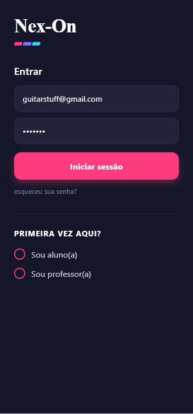
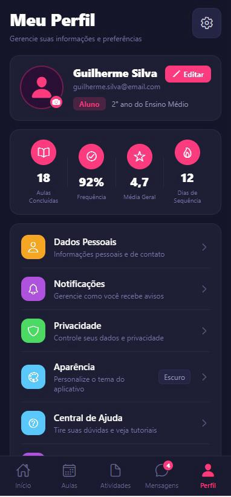
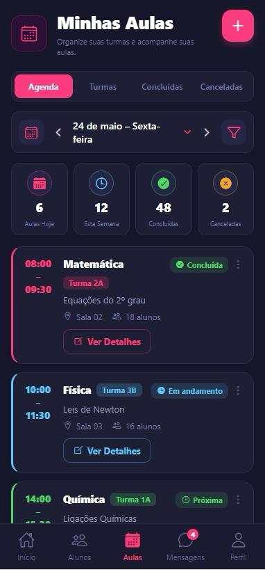

# Nex-On

<p align="center">
  <strong>Uma plataforma mobile para conectar alunos e professores de forma simples, organizada e intuitiva.</strong>
</p>

---

## 📖 Sobre o projeto

O **Nex-On** é um aplicativo mobile desenvolvido como projeto acadêmico com o objetivo de facilitar a conexão entre alunos e professores em uma única plataforma.

A aplicação oferece recursos para cadastro de usuários, autenticação, gerenciamento de aulas, acompanhamento de atividades e interação entre os usuários, proporcionando uma experiência prática e organizada para o ensino personalizado.

Além do desenvolvimento da aplicação, o projeto teve como foco a aplicação de conceitos de Engenharia de Software, desenvolvimento mobile, integração entre frontend e backend e modelagem de banco de dados.

---

## ✨ Funcionalidades

- Cadastro e login de usuários
- Autenticação
- Perfil de aluno e professor
- Gerenciamento de aulas
- Dashboard com informações do usuário
- Histórico de atividades
- Sistema de notificações
- Interface intuitiva e responsiva
- Integração com banco de dados

---

## 🛠 Tecnologias utilizadas

### Mobile
- React Native

### Backend
- Node.js

### Banco de Dados
- SQL

### Outras tecnologias
- API REST
- Sistema de autenticação

---

## 📷 Telas do aplicativo

| Login | Perfil | Minhas Aulas |
|-------|---------|--------------|
|  |  |  |

> *As imagens acima são ilustrativas e representam algumas das principais telas do aplicativo.*

---

## 🏗 Estrutura do projeto

```text
mobile/
backend/
database/
docs/
```

---

## 🎯 Objetivos

O projeto foi desenvolvido com o propósito de:

- Facilitar a comunicação entre alunos e professores;
- Organizar o gerenciamento de aulas particulares;
- Centralizar informações acadêmicas em um único aplicativo;
- Aplicar conceitos de desenvolvimento de software em um projeto real.

---

## 🚀 Processo de desenvolvimento

Durante o desenvolvimento foram aplicadas etapas como:

- Levantamento de requisitos;
- Modelagem do banco de dados;
- Planejamento da arquitetura da aplicação;
- Desenvolvimento da interface mobile;
- Implementação do backend;
- Integração entre aplicação e banco de dados;
- Testes das funcionalidades.

---

## 🔮 Melhorias futuras

Algumas funcionalidades planejadas para versões futuras incluem:

- Chat em tempo real;
- Notificações push;
- Avaliação de professores;
- Agendamento mais avançado;
- Integração com calendário;
- Pagamentos online;
- Videochamadas para aulas.

---

## 👨‍💻 Autor

Desenvolvido por **Guilherme Rodrigues Silva** como projeto acadêmico para aplicação prática dos conhecimentos adquiridos durante o curso de **Análise e Desenvolvimento de Sistemas**.

---

## 📄 Licença

Este projeto foi desenvolvido exclusivamente para fins acadêmicos e educacionais.
